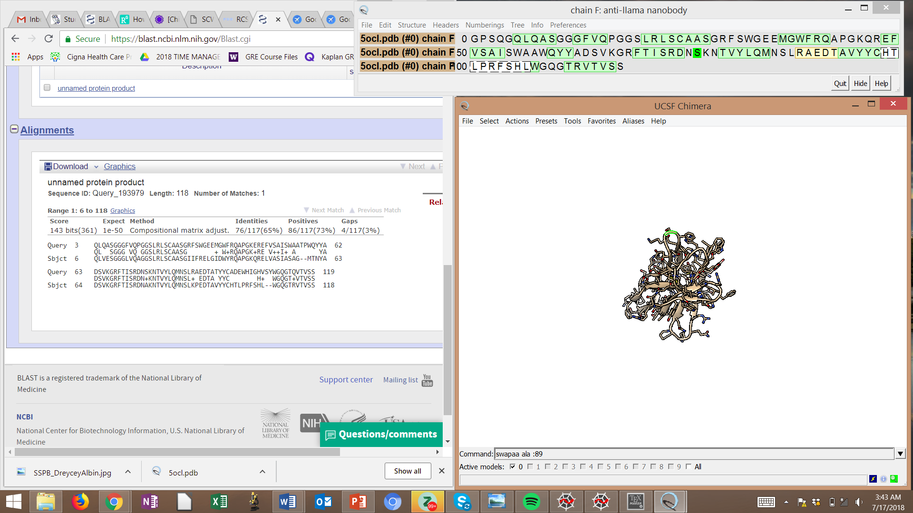
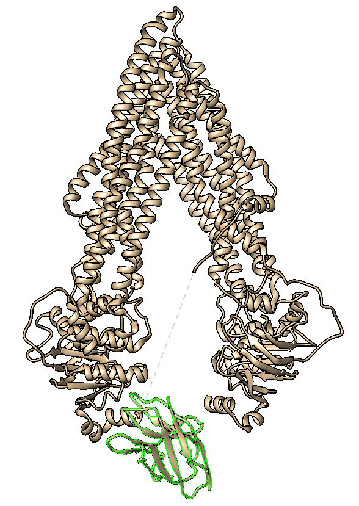
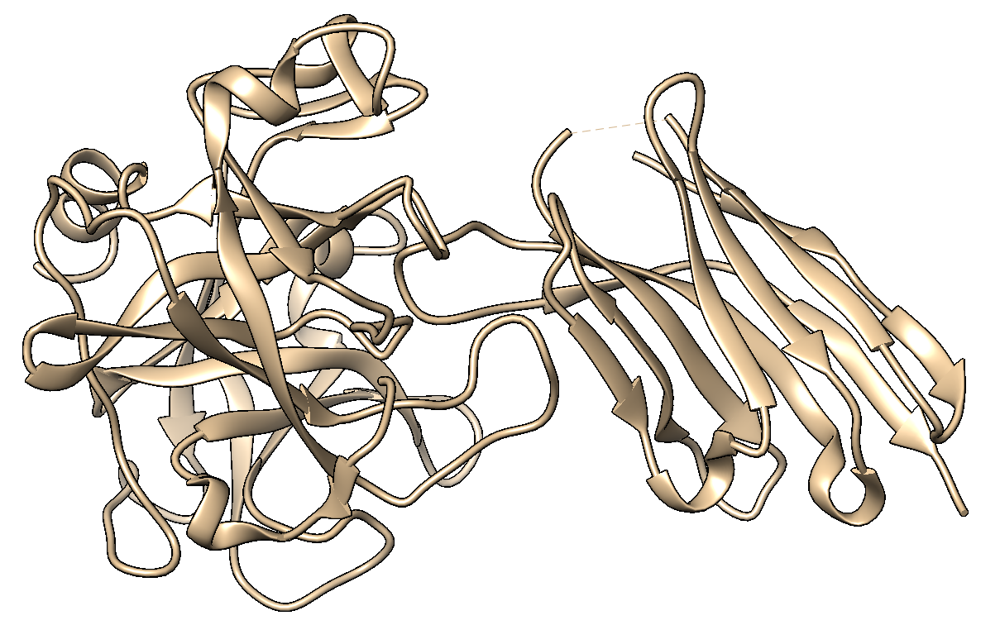

# Using Homologous Proteins To Model Different Nanobodies

## Dreycey Albin, 2018

The goal for homology modeling the nanobody structure was to use structures
already solved using experiment (crystal or NMR structures). Using these
structures, the different residues may be mapped onto the backbone of the
solved structure, giving a realistic model of the nanobody complexes. As a
first attempt to accomplish this goal, Chimera was used. Within Chimera, users
have the ability to use different rotamer libraries to exchange residues within
a structure. While this worked, it was extremely tedious. For this reason, a
different program was used to accomplish this goal: SCWRL4. This program allows
users to quickly flow through the Dunbrack rotamer library, replacing residues
while reducing clashing using a decision tree. It worked very quickly and
seemed to be an ideal option for homology modeling.

## Sequences Given From Shoukai

CDR1/CDR2/CDR3 are in bold, in order

 * 1st Binder Sequences
   * CBD1-N1: EVQLQASGGGFVQPGGSLRLSCAASG**STSRQYD**MGWFRQAPGKEREFVSAIS**SNQDQPP**YYADSVKGRFTISRDNSKNTVYLQMNSLRAEDTATYYCA**FKQHHANGA**YWGQGTQVTVSS
 * 2nd Binder Sequences
   * CBD1-N1: EVQLQASGGGFVQPGGSLRLSCAASG**RFSWGEE**MGWFRQAPGKEREFVSAIS**WAATPWQ**YYADSVKGRFTISRDNSKNTVYLQMNSLRAEDTATYYCA**DEWHIGHVS**YWGQGTQVTVSS
   * CBD1-N2: EVQLQASGGGFVQPGGSLRLSCAASG**YTSFQYV**MGWFRQAPGKEREFVSAIS**WLNGQVH**YYADSVKGRFTISRDNSKNTVYLQMNSLRAEDTATYYCA**SMVFDHPQSGGGVET**YWGQGTQVTVSS
   * CBD1-N3: EVQLQASGGGFVQPGGSLRLSCAASG**DSWELEA**MGWFRQAPGKEREFVSAIS**WHPTQWS**YYADSVKGRFTISRDNSKNTVYLQMNSLRAEDTATYYCA**QPGFDIPDR**YWGQGTQVTVSS


## Using Chimera

Nanobody-anti-VGLUT nanobody complex http://www.rcsb.org/structure/5OCL

website with tutorial (swapaa command can be used to accomplish this goal):
http://plato.cgl.ucsf.edu/pipermail/chimera-users/2009-April/003774.html

Using Sequence 2nd CBD1-N1 protein

Starting Nanobody Structure:
GPSQGQLVESGGGLVQAGGSLRLSCAASGIIFRELGIDWYRQAPGKQRELVASIASAGMTNYADSVKGRFTISRDNAKNTVYLQMNSLKPEDTAVYYCHTLPRFSHLWGQGTRVTVSS



Screenshot of what my desktop looked like to use chimera command swapaa to accomplish this goal.

## Using SCWRL4

Where to download scwrl4: http://dunbrack.fccc.edu/scwrl4/

nanobody with highest sequence similarity: http://www.pnas.org/content/110/33/13386




The desired nanobody is shown in Green.

 * [sequence of model (input) PDB:](https://www.rcsb.org/structure/4KSD)
   * QVQLQESGGGLVQAGGSLRLSCAASGRTFNSAVMGWFRQAPGKERQFVATIDWSGEYTYYADSVKGRFTISRDNAKNTVYLQMTSLKPEDTALYYCAARLTLGQFDYWGQGTQVTVSSHHHHHH
 * Sequence wanted (2nd CBD1-N1 protein):
   * EVQLQASGGGFVQPGGSLRLSCAASG**RFSWGEE**MGWFRQAPGKEREFVSAIS**WAATPWQ**YYADSVKGRFTISRDNSKNTVYLQMNSLRAEDTATYYCA**DEWHIGHVS**YWGQGTQVTVSS
 * Input sequence for sequence restrictions:
   * EvqlqAsgggFvqPggslrlscaasgrFSWGEEmgwfrqapgkerEfvSAiSwAAPWQyyadsvkgrftisrdnSkntvylqmNslRAedtaTyycaDWHITgHVSywgqgtqvtvsshhhhhh
 * Command used in SCWRL4:

```
Scwrl4.exe -i nanobody_of_4KSD.pdb -s sequencefile_1.txt -o nanobody_2_1
```

 * Output sequence:
   * EVQLQASGGGFVQPGGSLRLSCAASG**RFSWGEE**MGWFRQAPGKEREFVSAIS**WAAPWQ**YYADSVKGRFTISRDNSKNTVYLQMNSLRAEDTATYYCA**DWHITGHVSYWGQGTQVTVSS

Note there was one amino acid difference in 3rd bold region.

This method was way faster than using chimera command line swapaa command for each mutation to homologous backbone construct.

## MAKING ALL THE MODELS USING SCWRL4

### Overall Method:

 1. Get sequence of the nanobody
 2. Protein BLAST nanobody sequence
 3. Find most similar sequence, with low gaps, that contains a structure
 4. Delete other structure from the PDB model, making a nanobody-only pdb model
 5. Make input sequence file. Lower case residues will stay constant, uppercase will be replaced
 6. Enter command in for SCWRL4, as shown below in the examples.

### 2nd CBD1-N2 Protein

#### Sequence wanted:

EVQLQASGGGFVQPGGSLRLSCAASGYTSFQYVMGWFRQAPGKEREFVSAISWLNGQVHYYADSVKGRFTISRDNSKNTVYLQMNSLRAEDTATYYCASMVFDHPQSGGGVETYWGQGTQVTVSS

#### Protein BLAST Results:

https://blast.ncbi.nlm.nih.gov/Blast.cgi

closest homolog: PDB name: 5LHR


#### Sequence for the PDB model:

qvqlqesggglvqaggslrlscaasgrtfssyvmgwfrqapgkerefvaaiswsggstnyadsvkgrftisrdnakntvylqmnslkpedtavyycaadlassrdvsswywgqgtqvtvssaaaypydvpdygshhhhhh

#### Input sequence for sequence restrictions (named sequencefile_2.txt):

EvqlqAsgggFvqPggslrlscaasgYtSFQyvmgwfrqapgkerefvSaiswLNgQVHyadsvkgrftisrdnSkntvylqmnslRAedtaTyycaSdHPQsGGGVETywgqgtqvtvssaaaypydvpdygshhhhhh

#### Command used in SCWRL4:

```
Scwrl4.exe -i nanobody_from_5LHR.pdb -s sequencefile_2.txt -o nanobody_2_2
```

#### Sequence of output PDB model:

EVQLQASGGGFVQPGGSLRLSCAASGYTSFQYVMGWFRQAPGKEREFVSAISWLNGQVHYADSVKGRFTISRDNSKNTVYLQMNSLRAEDTATYYCASDHPQSGGGVETYWGQGTQ

### 2nd CBD1-N3 Protein

#### Sequences wanted:

EVQLQASGGGFVQPGGSLRLSCAASGDSWELEAMGWFRQAPGKEREFVSAISWHPTQWSYYADSVKGRFTISRDNSKNTVYLQMNSLRAEDTATYYCAQPGFDIPDRYWGQGTQVTVSS

#### Protein BLAST Results:

https://blast.ncbi.nlm.nih.gov/Blast.cgi

closest homolog: PDB name: 5LHR




As shown, the nanobody was a “chain” within the crystal complex

#### Sequence for the PDB model:

qvqlqesggglvqaggslrlscaasgrtfssyvmgwfrqapgkerefvaaiswsggstnyadsvkgrftisrdnakntvylqmnslkpedtavyycaadlassrdvsswywgqgtqvtvssaaaypydvpdygshhhhhh

#### Input sequence for sequence restrictions (named sequencefile_3.txt):

EvqlqAsgggFvqPggslrlscaasgYtSFQyvmgwfrqapgkerefvSaiswLNgQVHyadsvkgrftisrdnSkntvylqmnslRAedtaTyycaSdHPQsGGGVETywgqgtqvtvssaaaypydvpdygshhhhhh

#### Command used in SCWRL4:

```
Scwrl4.exe -i nanobody_from_5LHR.pdb -s sequencefile_3.txt -o nanobody_2_3
```

#### Sequence of output PDB model:

EVQLQASGGGFVQPGGSLRLSCAASGDSWELEAMGWFRQAPGKEREFVSAISWHPTQWSYYADSVKGRFTISRDNSKNTVYLQMNSLRAEDTATYYCAADLQPGFDIPDRYWGQGT

### 1st CBD1-N1 Protein

#### Sequences wanted:

EVQLQASGGGFVQPGGSLRLSCAASGSTSRQYDMGWFRQAPGKEREFVSAISSNQDQPPYYADSVKGRFTISRDNSKNTVYLQMNSLRAEDTATYYCAFKQHHANGAYWGQGTQVTVSS

#### Protein BLAST Results:

closest homolog: PDB name: 1VHP


#### Sequence for the PDB model:

EVQLVESGGGLVQPGGSLRLSCAASGFTFSSYAMSWVRQAPGKEREIVSAVSGSGGSTYYADSVKGRFTISRDNSKNTLYLQMNSLRAEDTAVYYCARLKKYAFDYWGQGTLVTVSS

#### Input sequence for sequence restrictions (named sequencefile_4.txt):

evqlQAsgggFvqpggslrlscaasgStSRQyDmGwFrqapgkereFvsaIsSNQDQPyyadsvkgrftisrdnskntVylqmnslraedtaTyycaFKQHHaNGywgqgtQvtvss

#### Command used in SCWRL4:

```
Scwrl4.exe -i 1VHP_single_nanobody.pdb -s sequencefile_4.txt -o nanobody_1_1
```

#### Sequence of output PDB model:

EVQLQASGGGFVQPGGSLRLSCAASGSTSRQYDMGWFRQAPGKEREFVSAISSNQDQPYYADSVKGRFTISRDNSKNTVYLQMNSLRAEDTATYYCAFKQHHANGYWGQGTQVTVSS
